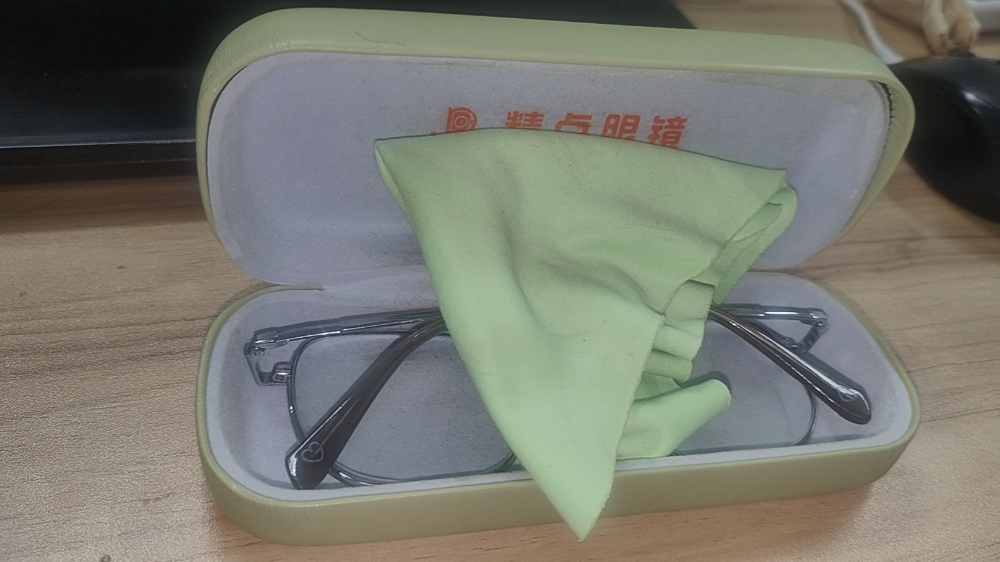
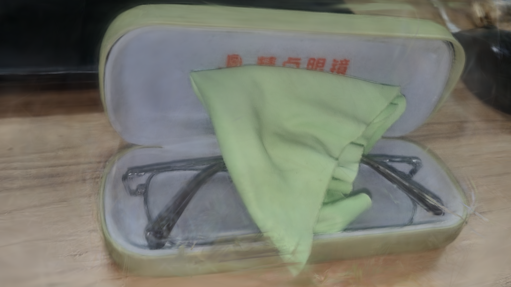
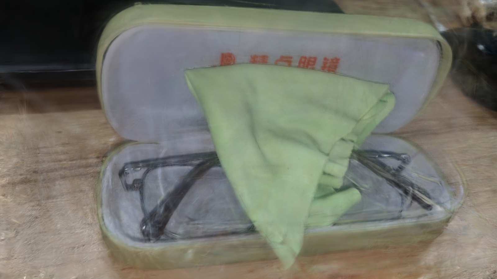
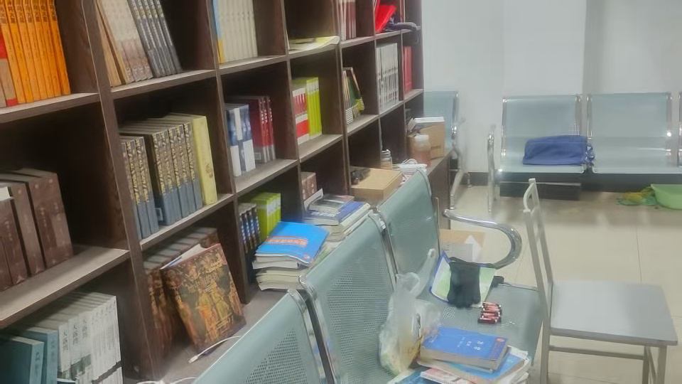
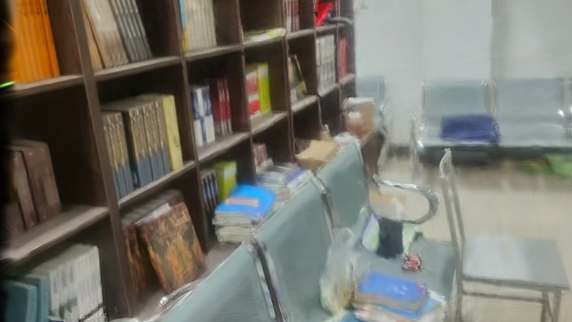
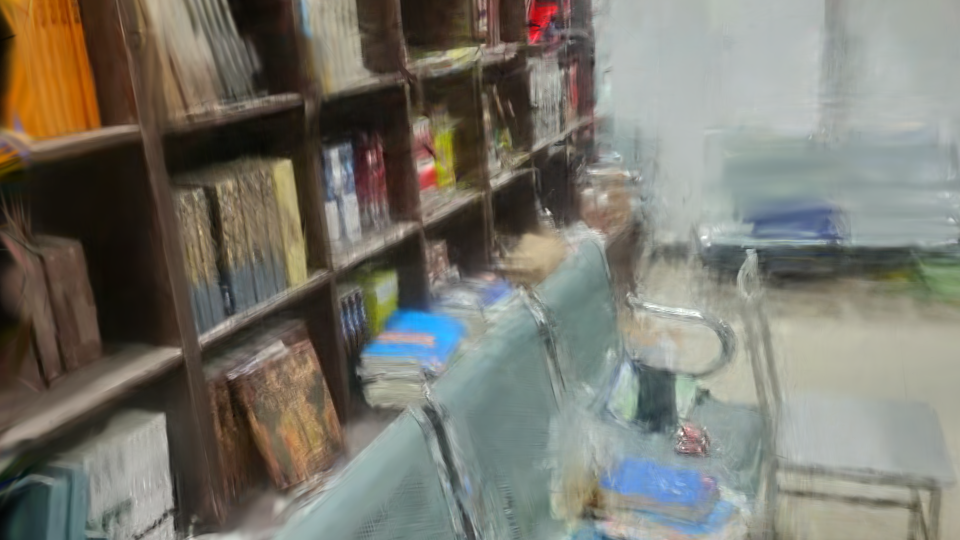

# 🚀️ Project Guide 🚀️

## :page_facing_up: 1.TODO List :page_facing_up:

- [ ] 1.Design a data loader for the WHU-OMVS dataset to load information of appropriate sizes and camera-related parameters
- [ ] 2.Complete the technical report designed for the project, including detailed technical implementation details and possible difficulties
- [ ] 3.Use DepthAnything to perform unconstrained 3D reconstruction representation on the dataset images, and calculate the corresponding AUC and F1 metrics
- [ ] 4.Use SAM3D for relevant 3D reconstruction representation of the map to form corresponding data assets

## :date: 2.Evaluation Metrics :date:

The metrics for 3D representation in the field of 3D reconstruction this time are mainly divided into: (1) Camera pose estimation accuracy: AUC (Area Under Curve) is based on Relative Rotation Accuracy (RRA) and Relative Translation Accuracy (RTA) to measure the error tolerance of pose estimation between different views. (2) Geometric reconstruction accuracy: F1 (F1 Score) measures the matching degree between the reconstructed point cloud and the real point cloud, and Chamfer Distance (CD) represents the average distance between the reconstructed point cloud and the real point cloud (specifically for the DTU dataset). (3) Monocular depth estimation accuracy: δ1 is the proportion of pixels where the relative error between the predicted depth and the real depth is less than 1.25 times; Absolute Relative Error (AbsRel) and Squared Relative Error (SqRel) measure the absolute/squared deviation of depth prediction, with smaller values indicating smaller errors. (4) Visual rendering metrics: PSNR, SSIM, and LPIPS are used to measure the visual metrics after synthesizing new view renderings.

## :file_folder: 3.Download Dataset :file_folder:

The dataset used in the experiment is mainly the [WHU-OMVS Dataset](https://gpcv.whu.edu.cn/data/WHU_OMVS_dataset/WHU_dataset.htm), which includes four compressed packages: train.zip (67.1G), test.zip (22.1G), predict.zip (45.7G), and readme.zip (1.72K). Meanwhile, we provide [download_utils.py](https://github.com/Rtwotwo/FF3DR/blob/main/utils/download_utils.py)) to automatically download the files and save them in the data folder. The startup command is as follows:

```bash
# move to your work folder
mkdir ./your/work/folder && cd ./your/work/folder
python ./utils/download_utils.py --save_dir ./your/dataset/folder
```

To finish the feedforward 3D reconstruction task, we use DJI UAV to collect image with UAV's view to build the FF3R model. And before use UAV, the camera and imu should be calibrated, which depends on [imu_utils](https://github.com/gaowenliang/imu_utils.git) and [kalibr](https://github.com/ethz-asl/kalibr.git). Becanse of Ubuntu22.04 version, we use docker to install kalibr and imu_utils tools to avoid system conflicts.

```bash
# install ros1 on the ubuntu22.04
docker pull osrf/ros:noetic-desktop-full
# enter into the docker and install dependencics
docker run -it --name kalibr_noetic \
    -v /tmp/.X11-unix:/tmp/.X11-unix -e DISPLAY=$DISPLAY \
    -v $(pwd)/data:/data \
    ros:noetic-desktop-full bash

# install related tools
apt update && apt install -y \
    git \
    wget \
    vim \
    nano \
    build-essential \
    python3-pip \
    libyaml-cpp-dev \
    libceres-dev
# clone the kalibr and imu_utils tool
mkdir -p /catkin_ws/src
cd /catkin_ws/src
git clone https://github.com/ethz-asl/kalibr.git
git clone https://github.com/gaowenliang/imu_utils.git
cd /catkin_ws
catkin_make -DCMAKE_BUILD_TYPE=Release
source devel/setup.bash
```

Next, you can process data in the docker container: 1.record or convert video/image data in the ros2 environment, use rosbags covert to convert the ros2bag into ROS1 bag; 2.make camera and imu calibration in the docker.

```bash
# record or convert  data
pip install rosbags
rosbags convert --src ros2_bag/ --dst ros1_bag.bag

# run camera and imu calibration
docker start -ai kalibr_noetic
rosrun kalibr kalibr_calibrate_cameras --bag /data/ros1_bag.bag ...
rosrun kalibr kalibr_calibrate_imu_camera --bag /data/ros1_bag.bag ...
rosrun imu_utils imu_an /data/imu.bag
```

## :video_camera: 4.Demo Show :video_camera:

We tested VGGT and VGGT_SLAM in 3D reconstruction and novel view synthesis on various video scenes captured through gestures: a. First, we used opencv-python to convert the captured videos into images and performed frame extraction; b. We used VGGT instead of the traditional colmap for camera pose estimation and sparse reconstruction in SFM, obtaining files containing camera pose parameters and point clouds; c. We further trained and tested the sparse reconstruction results using 3D Gaussian Splatting or the better Mip-Splatting technology to achieve novel view synthesis. We tested this pipeline with some self-captured videos to evaluate whether it can achieve the required effects. The following are some qualitative examples for viewing.

| Ground Truth | 3DGS | Mip-Splatting |
| :---: | :---: | :---: |
|  |  |  |
|  |  |  |

The following shows the schematic effect of the point cloud after 3D reconstruction using VGGT\_SLAM. Compared with the original images, there are still holes and outliers. It can be found that currently, VGGT - like models can achieve better reconstruction results than the traditional Colmap when there are few perspectives. However, when there are a large number of perspective images, there are still some shortcomings and problems with the model's generalization ability.

| Glassbox | Library |
|:---:|:---:|
|  |  |
| Room | Studyroom |
|  |  |

