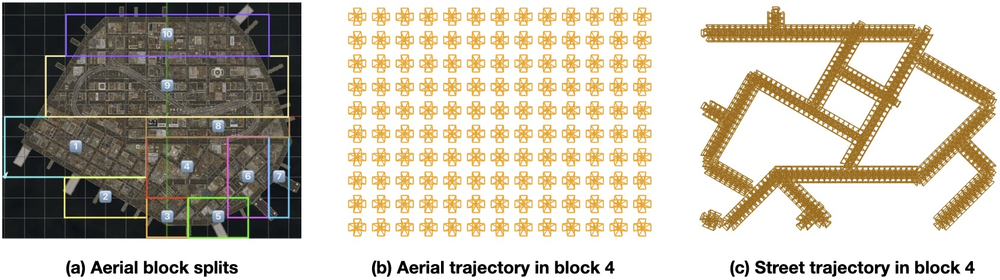

# :rocket: Project Guide :rocket:

## 🎉️ Visualization 🎉️

Currently, we render the PolyTech scene in UrbanScene3D and display its gsplt rendering effect as well as the depth prediction effect of Depthanything3. Subsequently, we will measure the PSNR, SSIM and LPILS indices after rendering to provide a reference for evaluating the performance of the feedforward 3D reconstruction model in regressing 3D representations using aerial images captured from a drone perspective.

|        ArtSci         |        Bridge         |        Castle         |
| :-------------------: | :-------------------: | :-------------------: |
|  |  |  |

|       PolyTech        |        School         |         Town          |
| :-------------------: | :-------------------: | :-------------------: |
|  |  |  |

## :gear: Running :gear:

This FF3DR experiment mainly conducted tests on public datasets WHU-OMVS, MatrixCity and UrbanScene3D. An optimization scheme for the depth estimation model based on the feed-forward paradigm was designed and implemented. Taking Depth Anything3 (DA3) as the basic depth network, aiming at the reconstruction shortcomings in complex UAV aerial survey scenarios, the parameter-efficient fine-tuning strategy of Low-Rank Adaptation (LoRA) was introduced to complete domain adaptation optimization while keeping the backbone model unchanged. The specific relevant code is shown as follows:

First, we conduct LoRA fine-tuning training based on the DepthAnything3 model. The relevant code is located at [run_train_da3_lora_whuomvs.py](running/training/run_train_adamvs_whuomvs.py), with the corresponding startup script [run_train_da3_lora_whuomvs.sh](running/scripts/training/run_train_da3_lora_whuomvs.sh). You can start the training directly by following the instructions below.

Secondly, the experimental code for feature-level fusion training of the DA3 model and traditional aviation models is [run_train_da3mvs_lora_whuomvs.py](running/training/run_train_da3mvs_lora_whuomvs.py), and the corresponding startup script is [run_train_da3mvs_lora_whuomvs.sh](running/scripts/training/run_train_da3mvs_lora_whuomvs.sh). However, it should be noted that this training model requires the model weights obtained from the aforementioned LoRA fine-tuning of DA3 for the second-stage training. Therefore, the weight path at line #24 in [run_train_da3mvs_lora_whuomvs.sh](running/scripts/training/run_train_da3mvs_lora_whuomvs.sh) can be modified to correctly map the LoRA fine-tuned weights.

Thirdly, the training of traditional aerial 3D reconstruction algorithms is similar, implemented via [run_train_adamvs_whuomvs.sh](running/scripts/training/run_train_adamvs_whuomvs.sh). Note that the hyperparameters related to model training mentioned above, including training epochs, learning rate, scheduling strategy and other parameters, are all modified within the bash file.

```bash 
# Train the DA3 model with LoRA fine-tuning, dataset: WHU-OMVS
bash running/scripts/training/run_train_da3_lora_whuomvs.sh

#Joint training of LoRA DA3+Ada-MVS with feature fusion, dataset WHU-OMVS
bash running/scripts/training/run_train_da3mvs_lora_whuomvs.sh

# Train the Ada-MVS algorithm with the WHU-OMVS dataset
bash running/scripts/training/run_train_adamvs_whuomvs.sh
```

## 🌍 Dataset 🌍

We have provided dataset download scripts for [WHU-OMVS](download/download_whuomvs.sh) and [MatrixCity-SmallCity](download/download_matrixcity.sh). You can run the scripts within the project folder to download the datasets. However, for the UrbanScene3D dataset, as official download links are provided, you can download the required parts from the corresponding [UrbanScene Baidu Netdisk](https://pan.baidu.com/s/1nqurXpbMzFo_-Cmf6eheOw?pwd=7zdg).

```bash
cd your/project/directory && mkdir dataset
bash ./download/download_matrixcity.sh
bash ./download/download_whuomvs.sh
```

### WHU-OMVS Dataset

The dataset used in the experiment is mainly the [WHU-OMVS Dataset](https://gpcv.whu.edu.cn/data/WHU_OMVS_dataset/WHU_dataset.htm), which includes four compressed packages: train.zip (67.1G), test.zip (22.1G), predict.zip (45.7G), and readme.zip (1.72K). Following the division of the WHU-MVS dataset, the data of Area #1/4/5/6 were used for the training. One slight difference is that both Area #2 and Area #3 were used for the testing in Liu and Ji (2020), whereas, in this work, Area #2 was treated as the validation region and Area #3 was the test region.

The simulated cameras were arranged following a typical oblique five-view camera system. There is no displacement among the five cameras, that is, the five cameras are positioned to share the same projection center while looking in different directions. Camera #3 looks straight down, while the remaining four cameras have a tilt angle of 40°. Specifically, Camera #1 and Camera #5 look forward and backward, respectively, while Camera #2 and Camera #4 look to the right and left, respectively.

<div align="center">
   
  
</div>

### MatrixCity Dataset

[MatrixCity](https://city-super.github.io/matrixcity/) have constructed a large-scale, comprehensive, and high-quality synthetic dataset for urban-level neural rendering research. Leveraging Unreal Engine 5's city sample project, we have developed a pipeline that enables convenient collection of urban aerial and street-view images with authentic camera poses, while acquiring a range of additional data modalities. This pipeline also allows flexible control over environmental factors such as lighting, weather, pedestrians, and traffic flow, meeting the diverse requirements of tasks covering urban-level neural rendering and other related fields. The resulting pilot dataset, MatrixCity, contains 60,000 aerial images and 350,000 street-view images derived from two city maps covering a total area of 28 square kilometers.

<div align="center">
  
  
</div>

### UrbanScene3D Dataset

[UrbanScene3D](https://vcc.tech/UrbanScene3D) dataset is equipped with a 63GB simulator featuring a physics engine and a lighting system. It can not only generate diverse data but also simulate vehicles and unmanned aerial vehicles (UAVs) in simulated urban environments to support subsequent relevant research. The dataset covers 16 abundant scenarios with a total area of 136 square kilometers, including real large urban areas such as Suzhou, New York, Shanghai, San Francisco, Shenzhen and Chicago, as well as virtual scenes like campuses, residential districts, squares, hospitals, schools, towns, bridges and castles. Comprehensive benchmarks covering both virtual and real scenes have also been established. These benchmarks can be utilized to design and evaluate aerial route planning and 3D reconstruction algorithms, and compare the performance of different planning methods.

## ❤️ Thanks ❤️

This project relies on outstanding open-source projects including [DepthAnything3](https://github.com/ByteDance-Seed/Depth-Anything-3), [VGGT-Long](https://github.com/DengKaiCQ/VGGT-Long) and [Ada-MVS](https://github.com/gpcv-liujin/Ada-MVS). We appreciate the work done by the authors of the aforementioned open-source projects.

