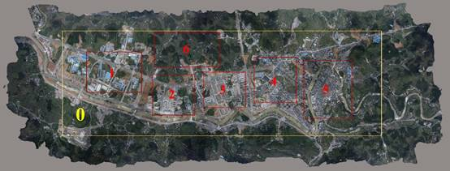
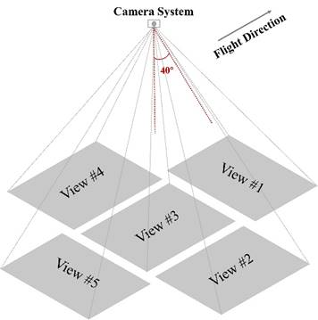

# :rocket: Project Guide :rocket:

## 🌍 Dataset 🌍

### 1.WHU-OMVS Dataset

The dataset used in the experiment is mainly the [WHU-OMVS Dataset](https://gpcv.whu.edu.cn/data/WHU_OMVS_dataset/WHU_dataset.htm), which includes four compressed packages: train.zip (67.1G), test.zip (22.1G), predict.zip (45.7G), and readme.zip (1.72K). Following the division of the WHU-MVS dataset, the data of Area #1/4/5/6 were used for the training. One slight difference is that both Area #2 and Area #3 were used for the testing in Liu and Ji (2020), whereas, in this work, Area #2 was treated as the validation region and Area #3 was the test region.

  s

The simulated cameras were arranged following a typical oblique five-view camera system. There is no displacement among the five cameras, that is, the five cameras are positioned to share the same projection center while looking in different directions. Camera #3 looks straight down, while the remaining four cameras have a tilt angle of 40°. Specifically, Camera #1 and Camera #5 look forward and backward, respectively, while Camera #2 and Camera #4 look to the right and left, respectively.

  

### 2.MatrixCity Dataset

