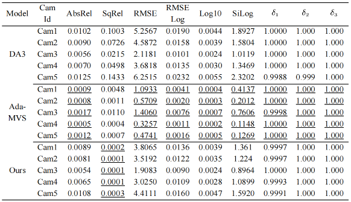
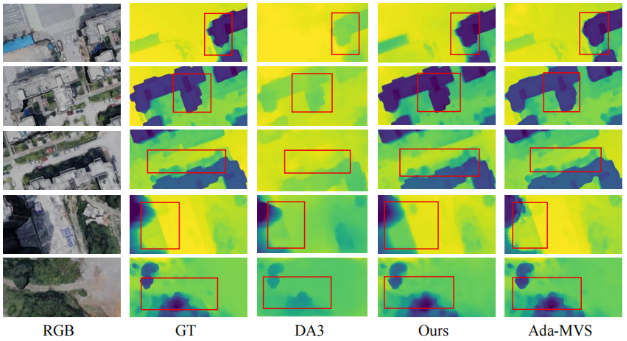
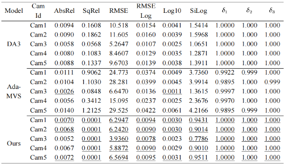
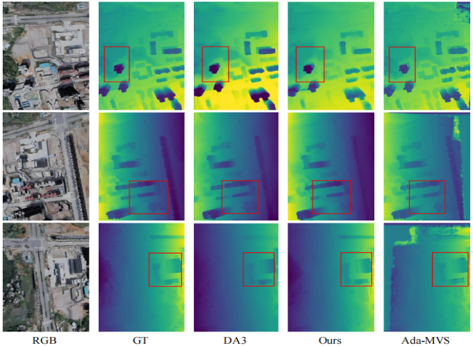

# :rocket: Project Guide :rocket:

For complex aerial photography scenarios of drones, LoRA is adopted to conduct domain adaptation on Depth Anything3, and a long-sequence 3D reconstruction system is designed. The challenges of long-image reconstruction are addressed through block-wise inference, coordinate alignment and loop closure optimization. Experiments verify that this solution can effectively improve reconstruction accuracy and generalization ability.

## 🎉️ Visualization 🎉️

The project experiment mainly conducts research on the WHU-OMVS dataset. We present the performance metrics and qualitative results of the LoRA-fine-tuned DA3 model, alongside the baseline models Ada-MVS for traditional aerial photogrammetry and the original DA3 model. The adopted metrics principally consist of absolute relative error, squared relative error, root mean square error, log root mean square error, log10 error, scale-invariant log error, threshold accuracy (1.25×), threshold accuracy (1.25²×), and threshold accuracy (1.25³×). The relevant test metrics and visualizations of depth information predicted by the models are displayed as follows.




The traditional Ada-MVS relies on the classic MVS architecture and achieves the highest accuracy on homogeneous domain data with extremely low values for all error metrics. Compared with the original DA3, the model fine-tuned via LoRA delivers comprehensive performance improvements. Notably, the squared relative error (SqRel) metric drops substantially, which effectively suppresses depth outliers. The reconstruction accuracy for building edges and weakly textured areas is greatly enhanced, and the depth prediction results show a higher degree of alignment with ground truth labels.




There is a notable disparity in the generalization ability of models on unseen Predict datasets that were not involved in training. The traditional Ada-MVS suffers a sharp performance drop with a steep surge in error metrics; its depth maps contain extensive noise, patches and structural damage, fully revealing its poor generalization capacity. The original DA3 maintains basic stability yet lacks sufficient capability for detail reconstruction. In contrast, the DA3 fine-tuned with LoRA proposed in this paper consistently retains low error levels, delivering clean and continuous depth maps free of obvious artifacts. It accurately reconstructs building outlines and topographic details, which verifies that this optimization scheme enables the model to learn universal geometric features of aerial survey scenarios and endows it with strong cross-domain robustness.

Currently, we render the PolyTech scene in UrbanScene3D and display its gsplt rendering effect as well as the depth prediction effect of Depthanything3. Subsequently, we will measure the PSNR, SSIM and LPILS indices after rendering to provide a reference for evaluating the performance of the feedforward 3D reconstruction model in regressing 3D representations using aerial images captured from a drone perspective.

|        ArtSci         |        Bridge         |        Castle         |
| :-------------------: | :-------------------: | :-------------------: |
|  |  |  |
|       PolyTech        |        School         |         Town          |
| :-------------------: | :-------------------: | :-------------------: |
|  |  |  |
|       PolyTech NVS1        |        PolyTech NVS2         |
| :-------------------: | :-------------------: |
|  |  |

## :gear: Running :gear:

### Training

This FF3DR experiment mainly conducted tests on public datasets WHU-OMVS, MatrixCity and UrbanScene3D. An optimization scheme for the depth estimation model based on the feed-forward paradigm was designed and implemented. Taking Depth Anything3 (DA3) as the basic depth network, aiming at the reconstruction shortcomings in complex UAV aerial survey scenarios, the parameter-efficient fine-tuning strategy of Low-Rank Adaptation (LoRA) was introduced to complete domain adaptation optimization while keeping the backbone model unchanged. The specific relevant code is shown as follows:

First, we conduct LoRA fine-tuning training based on the DepthAnything3 model. The relevant code is located at [run_train_da3_lora_whuomvs.py](running/training/run_train_adamvs_whuomvs.py), with the corresponding startup script [run_train_da3_lora_whuomvs.sh](running/scripts/training/run_train_da3_lora_whuomvs.sh). You can start the training directly by following the instructions below.

Secondly, the experimental code for feature-level fusion training of the DA3 model and traditional aviation models is [run_train_da3mvs_lora_whuomvs.py](running/training/run_train_da3mvs_lora_whuomvs.py), and the corresponding startup script is [run_train_da3mvs_lora_whuomvs.sh](running/scripts/training/run_train_da3mvs_lora_whuomvs.sh). However, it should be noted that this training model requires the model weights obtained from the aforementioned LoRA fine-tuning of DA3 for the second-stage training. Therefore, the weight path at line #24 in [run_train_da3mvs_lora_whuomvs.sh](running/scripts/training/run_train_da3mvs_lora_whuomvs.sh) can be modified to correctly map the LoRA fine-tuned weights.

Thirdly, the training of traditional aerial 3D reconstruction algorithms is similar, implemented via [run_train_adamvs_whuomvs.sh](running/scripts/training/run_train_adamvs_whuomvs.sh). Note that the hyperparameters related to model training mentioned above, including training epochs, learning rate, scheduling strategy and other parameters, are all modified within the bash file.

```bash 
# Train the DA3 model with LoRA fine-tuning, dataset: WHU-OMVS
bash running/scripts/training/run_train_da3_lora_whuomvs.sh

#Joint training of LoRA DA3+Ada-MVS with feature fusion, dataset WHU-OMVS
bash running/scripts/training/run_train_da3mvs_lora_whuomvs.sh

# Train the Ada-MVS algorithm with the WHU-OMVS dataset
bash running/scripts/training/run_train_adamvs_whuomvs.sh
```

### Testing and Metrics

For the tasks of model indicator testing and depth map visualization of model predictions, we integrate the code for these two tasks together and share the visualization code. I will provide a detailed introduction to the specific usage methods. For the model evaluation, we adopt [run_adamvs_inference.sh](/running/scripts/inference/run_adamvs_inference.sh) to test the traditional Ada-MVS aerial 3D reconstruction algorithm, [run_da3lora_inference.sh](running/scripts/inference/run_da3lora_inference.sh) for testing the DA3 model fine-tuned via LoRA, and [run_da3mvs_inference.sh](running/scripts/inference/run_da3mvs_inference.sh) as well as [run_da3mvs_lora_inference.sh](running/scripts/inference/run_da3mvs_lora_inference.sh) as the codes for military tests and feature fusion tests of the LoRA DA3 and Ada-MVS algorithms. Note that all the aforementioned test codes share the same visualized depth map code [run_whuomvs_dsm_metric_inference.py](running/inference/run_whuomvs_dsm_metric_inference.py), which enables horizontal qualitative or quantitative comparisons. In addition, relevant hyperparameters can be modified directly in the above bash launch script files. The usage instructions are presented as follows.

```bash
# Test the DA3 model with LoRA fine-tuning, dataset: WHU-OMVS
bash running/scripts/inference/run_adamvs_inference.sh

#Joint Testing of LoRA DA3+Ada-MVS with feature fusion, dataset WHU-OMVS
bash running/scripts/inference/run_da3lora_inference.sh

# Test the Ada-MVS algorithm with the WHU-OMVS dataset
bash running/scripts/inference/run_da3mvs_inference.sh 
bash running/scripts/inference/run_da3mvs_lora_inference.sh
```

We also provide the original code for converting and visualizing depth data in the WHU-OMVS dataset to .exr format, namely [depth_utils.py](running/utils/depth_utils.py). The detailed usage is shown as follows.

```bash
# Visualize the depth ground truth in the dataset with code
python -m running.utils.depth_utils \
  --input_dir /data2/dataset/Redal/work_feedforward_3drepo/dataset/WHU-OMVS/test/area3/images/5 \
  --output_dir /data2/dataset/Redal/work_feedforward_3drepo/dataset/WHU-OMVS/test/area3/depths_viz/5
```

### System Reconstruction

Finally, before applying the feed-forward 3D reconstruction system with UAV perspective images, it adopts a five-stage architecture of "block-wise inference - local stitching - global alignment - loop closure optimization - evaluation output" to realize end-to-end reconstruction from UAV image sequences to 3D point clouds. The aforementioned workflow is mainly calibrated for visualizable 3D reconstruction on the MatrixCity and UrbanScene datasets, with 3D point cloud models as direct outputs. We provide code for large-scale scene reconstruction of four state-of-the-art feed-forward 3D reconstruction models ```DA3, MapAnything, Pi3, VGGT``` targeting the WHU-OMVS dataset at [run_whuomvs_inference.sh](running/scripts/inference/run_whuomvs_inference.sh). Scene reconstruction for the Test subsets of BigCity and SmallCity under MatrixCity is also implemented via [run_matrixcity_inference.sh](running/scripts/inference/run_matrixcity_inference.sh). The launch code for reconstructing six scenes from the UrbanScene dataset, namely PolyTech, ArtSci, Bridge, Town, Castle and School, is located at [run_urbanscene_inference.sh](running/scripts/inference/run_urbanscene_inference.sh). Note that the code corresponding to all the above launch scripts has been adapted to the file structures of the respective datasets, so users can directly adjust the dataset partition scheme ```Split: Train/Test/Val```. In cases where out-of-memory (OOM) errors occur during the reconstruction of certain scenes, the parameters ```CHUNK_SIZE=40,OVERLAP=16``` in the code can be modified to resolve the issue; generally, a larger CHUNK_SIZE yields better performance.

```bash
bash running/scripts/inference/run_whuomvs_inference.sh
bash running/scripts/inference/run_matrixcity_inference.sh
bash running/scripts/inference/run_urbanscene_inference.sh
```

## 🌍 Dataset 🌍

We have provided dataset download scripts for [WHU-OMVS](download/download_whuomvs.sh) and [MatrixCity-SmallCity](download/download_matrixcity.sh). You can run the scripts within the project folder to download the datasets. However, for the UrbanScene3D dataset, as official download links are provided, you can download the required parts from the corresponding [UrbanScene Baidu Netdisk](https://pan.baidu.com/s/1nqurXpbMzFo_-Cmf6eheOw?pwd=7zdg).

```bash
cd your/project/directory && mkdir dataset
bash ./download/download_matrixcity.sh
bash ./download/download_whuomvs.sh
```

### WHU-OMVS Dataset

The dataset used in the experiment is mainly the [WHU-OMVS Dataset](https://gpcv.whu.edu.cn/data/WHU_OMVS_dataset/WHU_dataset.htm), which includes four compressed packages: train.zip (67.1G), test.zip (22.1G), predict.zip (45.7G), and readme.zip (1.72K). Following the division of the WHU-MVS dataset, the data of Area #1/4/5/6 were used for the training. One slight difference is that both Area #2 and Area #3 were used for the testing in Liu and Ji (2020), whereas, in this work, Area #2 was treated as the validation region and Area #3 was the test region.

The simulated cameras were arranged following a typical oblique five-view camera system. There is no displacement among the five cameras, that is, the five cameras are positioned to share the same projection center while looking in different directions. Camera #3 looks straight down, while the remaining four cameras have a tilt angle of 40°. Specifically, Camera #1 and Camera #5 look forward and backward, respectively, while Camera #2 and Camera #4 look to the right and left, respectively.

<div align="center">
   
  
</div>

### MatrixCity Dataset

[MatrixCity](https://city-super.github.io/matrixcity/) have constructed a large-scale, comprehensive, and high-quality synthetic dataset for urban-level neural rendering research. Leveraging Unreal Engine 5's city sample project, we have developed a pipeline that enables convenient collection of urban aerial and street-view images with authentic camera poses, while acquiring a range of additional data modalities. This pipeline also allows flexible control over environmental factors such as lighting, weather, pedestrians, and traffic flow, meeting the diverse requirements of tasks covering urban-level neural rendering and other related fields. The resulting pilot dataset, MatrixCity, contains 60,000 aerial images and 350,000 street-view images derived from two city maps covering a total area of 28 square kilometers.

<div align="center">
  
  
</div>

### UrbanScene3D Dataset

[UrbanScene3D](https://vcc.tech/UrbanScene3D) dataset is equipped with a 63GB simulator featuring a physics engine and a lighting system. It can not only generate diverse data but also simulate vehicles and unmanned aerial vehicles (UAVs) in simulated urban environments to support subsequent relevant research. The dataset covers 16 abundant scenarios with a total area of 136 square kilometers, including real large urban areas such as Suzhou, New York, Shanghai, San Francisco, Shenzhen and Chicago, as well as virtual scenes like campuses, residential districts, squares, hospitals, schools, towns, bridges and castles. Comprehensive benchmarks covering both virtual and real scenes have also been established. These benchmarks can be utilized to design and evaluate aerial route planning and 3D reconstruction algorithms, and compare the performance of different planning methods.

## ❤️ Thanks ❤️

This project relies on outstanding open-source projects including [DepthAnything3](https://github.com/ByteDance-Seed/Depth-Anything-3), [VGGT-Long](https://github.com/DengKaiCQ/VGGT-Long) and [Ada-MVS](https://github.com/gpcv-liujin/Ada-MVS). We appreciate the work done by the authors of the aforementioned open-source projects.

