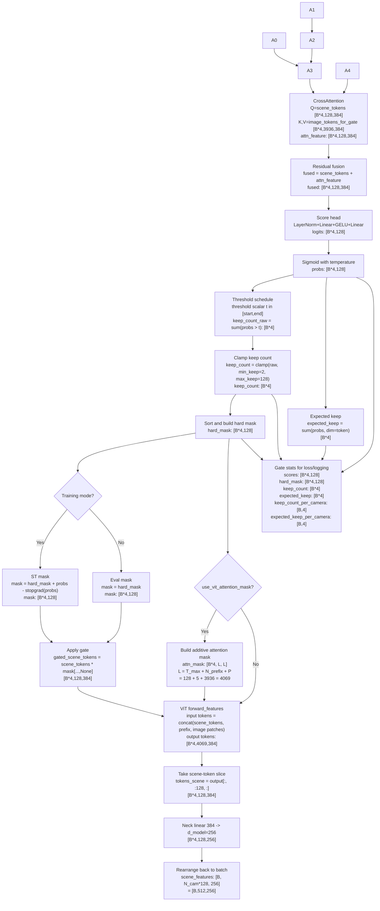
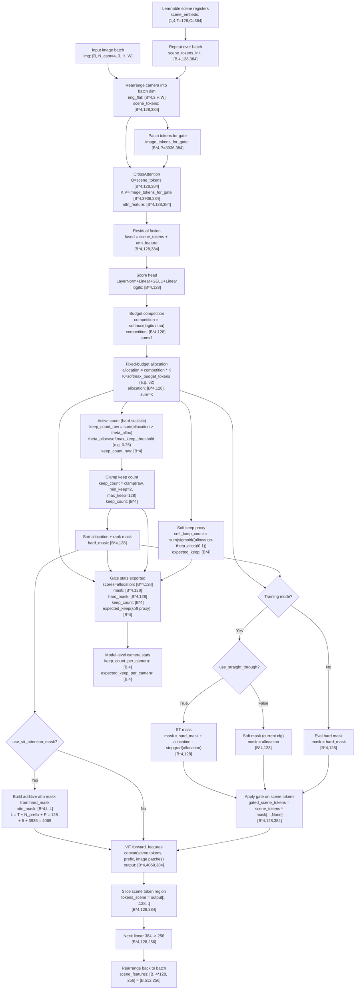

```mermaid
graph TD
    %% 隐藏连接用于布局控制
    A0 --> A3
    A1 --> A2 --> A3
    A3 --> G1
    A4 --> G1

    %% 核心流程节点
    G1["CrossAttention<br/>Q=scene_tokens [B*4,128,384]<br/>K,V=image_tokens_for_gate [B*4,3936,384]<br/>attn_feature: [B*4,128,384]"]
    G2["Residual fusion<br/>fused = scene_tokens + attn_feature<br/>fused: [B*4,128,384]"]
    G3["Score head<br/>LayerNorm+Linear+GELU+Linear<br/>logits: [B*4,128]"]
    G4["Sigmoid with temperature<br/>probs: [B*4,128]"]
    G5["Threshold schedule<br/>threshold scalar t in [start,end]<br/>keep_count_raw = sum(probs > t): [B*4]"]
    G6["Clamp keep count<br/>keep_count = clamp(raw, min_keep=2, max_keep=128)<br/>keep_count: [B*4]"]
    G7["Sort and build hard mask<br/>hard_mask: [B*4,128]"]
    
    G8{"Training mode?"}
    
    G9["ST mask<br/>mask = hard_mask + probs - stopgrad(probs)<br/>mask: [B*4,128]"]
    G10["Eval mask<br/>mask = hard_mask<br/>mask: [B*4,128]"]
    
    G11["Apply gate<br/>gated_scene_tokens = scene_tokens * mask[...,None]<br/>[B*4,128,384]"]
    G12["Expected keep<br/>expected_keep = sum(probs, dim=token)<br/>[B*4]"]
    
    G13{"use_vit_attention_mask?"}
    G14["Build additive attention mask<br/>attn_mask: [B*4, L, L]<br/>L = T_max + N_prefix + P<br/>= 128 + 5 + 3936 = 4069"]

    %% ViT 处理部分
    V1["ViT forward_features<br/>input tokens = concat(scene_tokens, prefix, image patches)<br/>output tokens: [B*4,4069,384]"]
    V2["Take scene-token slice<br/>tokens_scene = output[:, :128, :]<br/>[B*4,128,384]"]
    V3["Neck linear 384 -> d_model=256<br/>[B*4,128,256]"]
    V4["Rearrange back to batch<br/>scene_features: [B, N_cam*128, 256]<br/>= [B,512,256]"]

    %% 输出统计
    O1["Gate stats for loss/logging<br/>scores: [B*4,128]<br/>hard_mask: [B*4,128]<br/>keep_count: [B*4]<br/>expected_keep: [B*4]<br/>keep_count_per_camera: [B,4]<br/>expected_keep_per_camera: [B,4]"]

    %% 连接关系
    G1 --> G2 --> G3 --> G4 --> G5 --> G6 --> G7 --> G8
    G8 -- Yes --> G9 --> G11
    G8 -- No --> G10 --> G11
    G4 --> G12
    G7 --> G13
    G13 -- Yes --> G14 --> V1
    G13 -- No --> V1
    G11 --> V1
    V1 --> V2 --> V3 --> V4

    G4 --> O1
    G7 --> O1
    G6 --> O1
    G12 --> O1
```

```mermaid
graph TD
    %% -------------------------
    %% Inputs / reshape
    %% -------------------------
    I0["Input image batch<br/>img: [B, N_cam=4, 3, H, W]"]
    I1["Learnable scene registers<br/>scene_embeds: [1,4,T=128,C=384]"]
    I2["Repeat over batch<br/>scene_tokens_init: [B,4,128,384]"]
    I3["Rearrange camera into batch dim<br/>img_flat: [B*4,3,H,W]<br/>scene_tokens: [B*4,128,384]"]
    I4["Patch tokens for gate<br/>image_tokens_for_gate: [B*4,P=3936,384]"]

    I0 --> I3
    I1 --> I2 --> I3
    I3 --> I4

    %% -------------------------
    %% Gate (modified: budget_softmax mode)
    %% -------------------------
    G1["CrossAttention<br/>Q=scene_tokens [B*4,128,384]<br/>K,V=image_tokens_for_gate [B*4,3936,384]<br/>attn_feature: [B*4,128,384]"]
    G2["Residual fusion<br/>fused = scene_tokens + attn_feature<br/>[B*4,128,384]"]
    G3["Score head<br/>LayerNorm+Linear+GELU+Linear<br/>logits: [B*4,128]"]

    G4["Budget competition<br/>competition = softmax(logits / tau)<br/>competition: [B*4,128], sum=1"]
    G5["Fixed-budget allocation<br/>allocation = competition * K<br/>K=softmax_budget_tokens (e.g. 32)<br/>allocation: [B*4,128], sum=K"]

    G6["Active count (hard statistic)<br/>keep_count_raw = sum(allocation > theta_alloc)<br/>theta_alloc=softmax_keep_threshold (e.g. 0.25)<br/>keep_count_raw: [B*4]"]
    G7["Clamp keep count<br/>keep_count = clamp(raw, min_keep=2, max_keep=128)<br/>keep_count: [B*4]"]

    G8["Sort allocation + rank mask<br/>hard_mask: [B*4,128]"]
    G9["Soft keep proxy<br/>soft_keep_count = sum(sigmoid((allocation-theta_alloc)/0.1))<br/>expected_keep: [B*4]"]

    I3 --> G1
    I4 --> G1
    G1 --> G2 --> G3 --> G4 --> G5 --> G6 --> G7 --> G8
    G5 --> G9

    %% -------------------------
    %% Train / eval masking
    %% -------------------------
    M0{"Training mode?"}
    M1{"use_straight_through?"}
    M2["ST mask<br/>mask = hard_mask + allocation - stopgrad(allocation)<br/>[B*4,128]"]
    M3["Soft mask (current cfg)<br/>mask = allocation<br/>[B*4,128]"]
    M4["Eval hard mask<br/>mask = hard_mask<br/>[B*4,128]"]

    G5 --> M0
    G8 --> M0
    M0 -->|Yes| M1
    M1 -->|True| M2
    M1 -->|False| M3
    M0 -->|No| M4

    %% -------------------------
    %% Apply gate + ViT path
    %% -------------------------
    A1["Apply gate on scene tokens<br/>gated_scene_tokens = scene_tokens * mask[...,None]<br/>[B*4,128,384]"]

    V0{"use_vit_attention_mask?"}
    V1["Build additive attn mask from hard_mask<br/>attn_mask: [B*4,L,L]<br/>L = T + N_prefix + P = 128 + 5 + 3936 = 4069"]
    V2["ViT forward_features<br/>concat(scene tokens, prefix, image patches)<br/>output: [B*4,4069,384]"]
    V3["Slice scene token region<br/>tokens_scene = output[:, :128, :]<br/>[B*4,128,384]"]
    V4["Neck linear 384 -> 256<br/>[B*4,128,256]"]
    V5["Rearrange back to batch<br/>scene_features: [B, 4*128, 256] = [B,512,256]"]

    M2 --> A1
    M3 --> A1
    M4 --> A1

    G8 --> V0
    V0 -->|Yes| V1 --> V2
    V0 -->|No| V2
    A1 --> V2
    V2 --> V3 --> V4 --> V5

    %% -------------------------
    %% Gate stats for loss/logging
    %% -------------------------
    O1["Gate stats exported<br/>scores=allocation: [B*4,128]<br/>mask: [B*4,128]<br/>hard_mask: [B*4,128]<br/>keep_count: [B*4]<br/>expected_keep(soft proxy): [B*4]"]
    O2["Model-level camera stats<br/>keep_count_per_camera: [B,4]<br/>expected_keep_per_camera: [B,4]"]

    G5 --> O1
    G8 --> O1
    G7 --> O1
    G9 --> O1
    O1 --> O2
```
